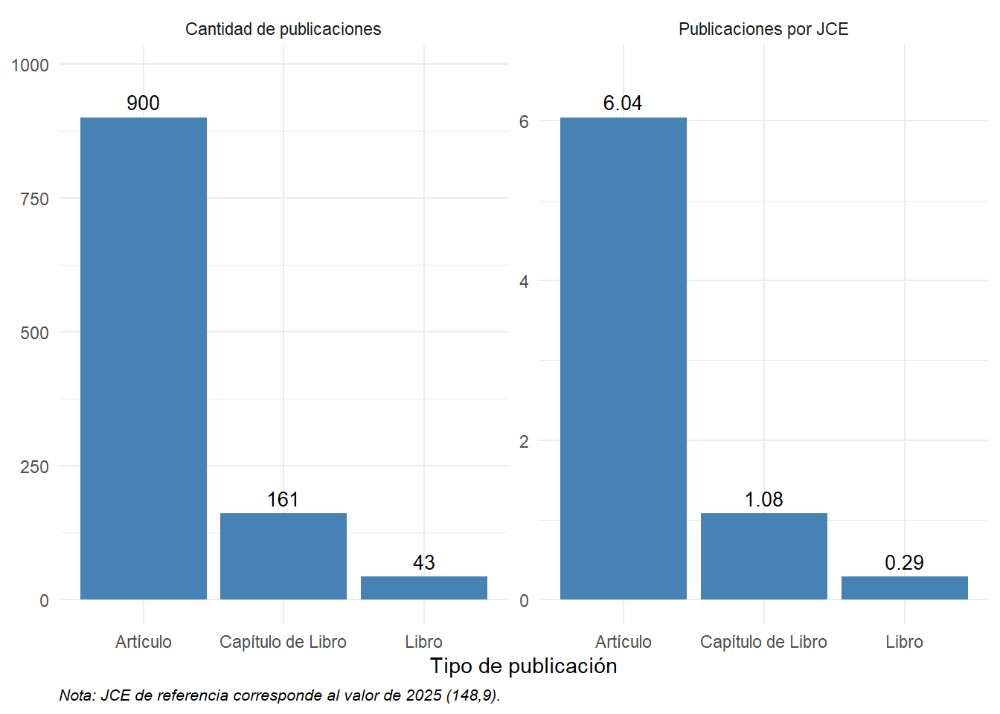
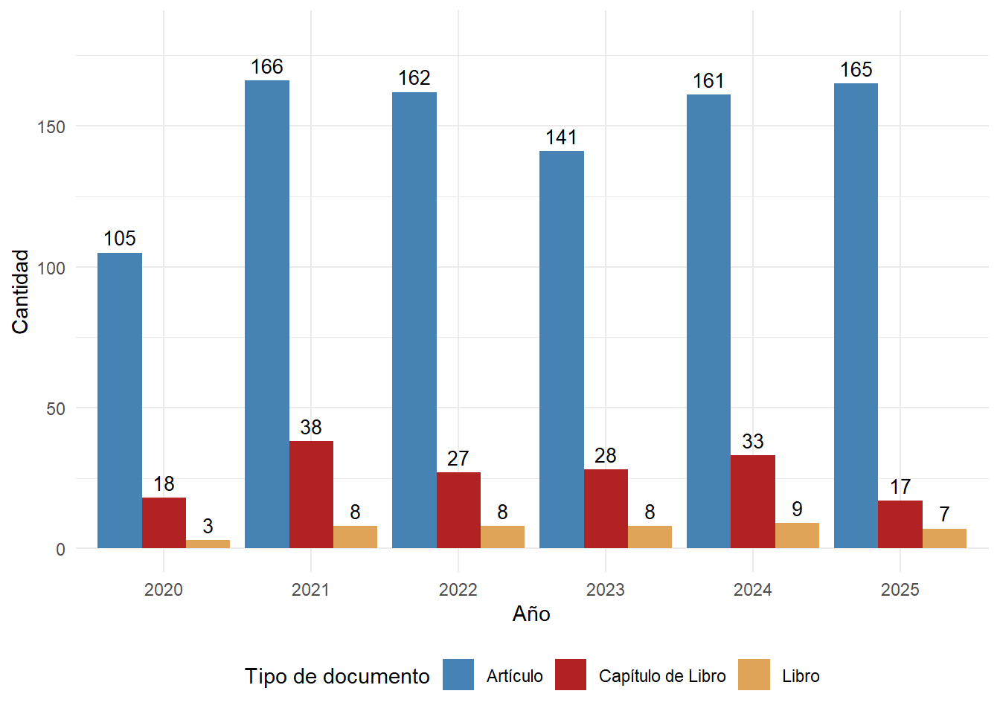
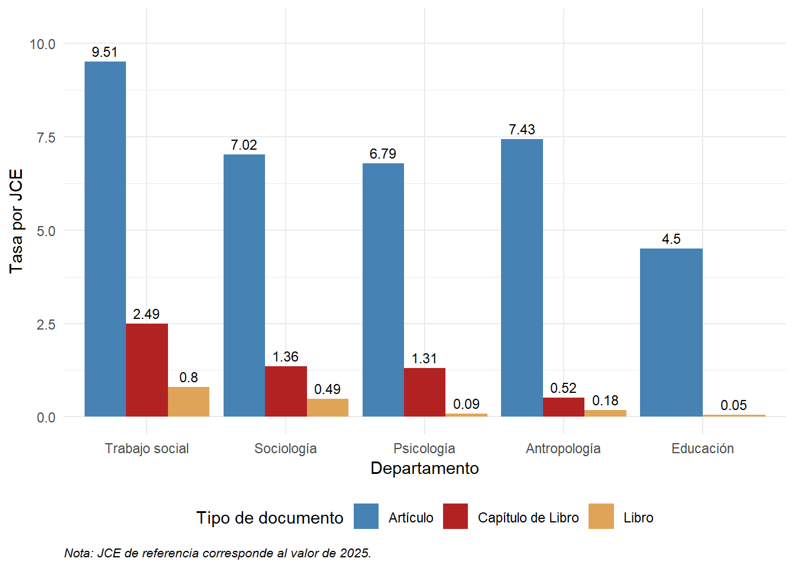
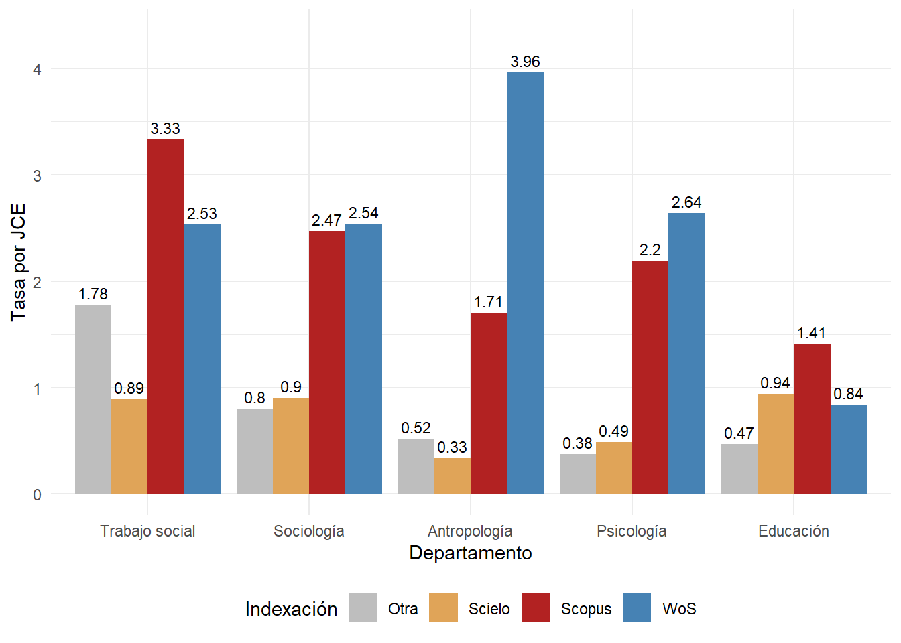
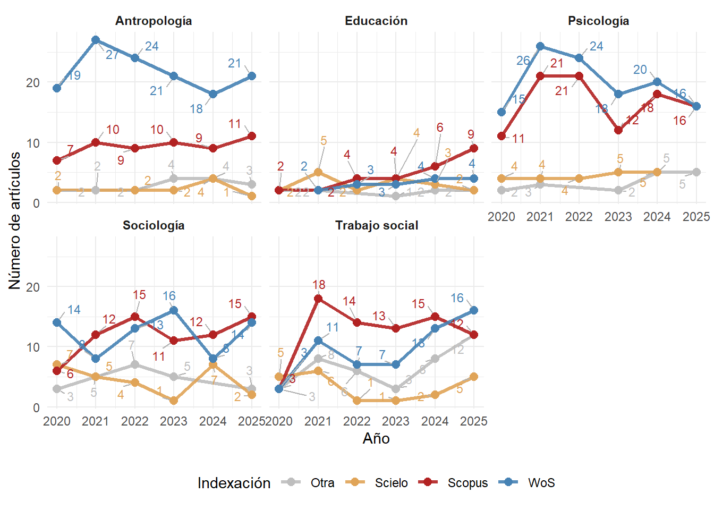
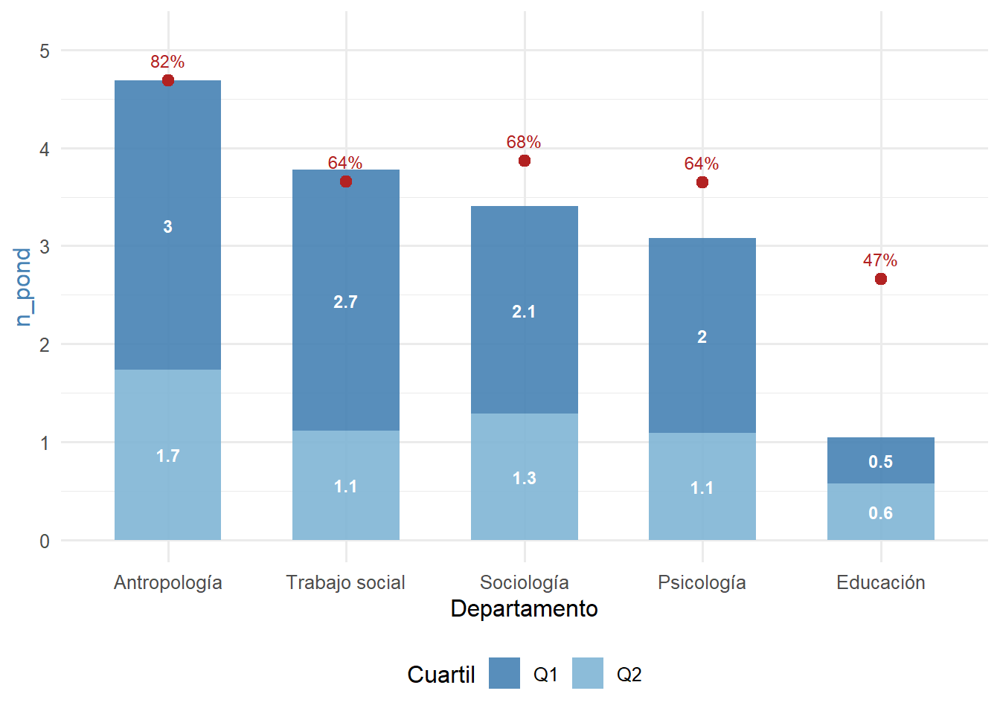
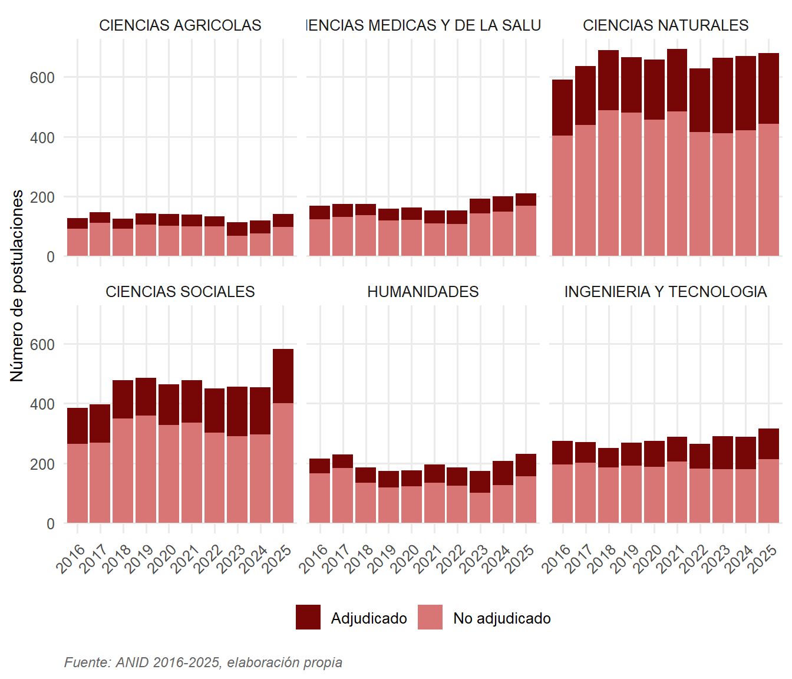

# Informe de Publicaciones FACSO

## Propósito

Este estudio corresponde a un análisis cuantitativo descriptivo que caracteriza el volumen, la composición y el impacto de la producción científica de la Facultad de Ciencias Sociales de la Universidad de Chile. El período de referencia corresponde a 2020-2025, con un universo de **1.162 publicaciones únicas** identificadas.

## Datos

La construcción de la base combinó múltiples fuentes:

- **SEPA-VID**  
- **API de ORCID**
- Bases de datos de **Web of Science**, **Scopus**, **Scielo** y **SCImago**
- **Académicos** con nombramiento vigente al 31 de diciembre de 2025

## Resultados



::: {.notes}
La producción total del período analizado fue de 1.162 publicaciones únicas, con un claro predominio de los artículos de revista (946, o un 81%), seguidos de 171 capítulos de libro (15%) y 45 libros (4%). La productividad total alcanzó las 7,8 publicaciones por JCE en 5 años. Tras un incremento sustancial entre 2020 y 2021, posiblemente atribuible a un efecto de rebote posterior a la pandemia, el volumen se mantuvo con relativa estabilidad entre 2022 y 2025 (ver @fig-publicacion-anio).
:::

---

<!--  -->

<!-- --- -->

```{r}
#| fig-cap: "Curva de Lorenz Publicaciones FACSO"

load("input/base-final.rdata")
load("input/acad-proc.rdata")

library(tidyverse)
library(ggpattern)

lorenz_data <- acad |> 
  distinct(rut) |> 
  left_join(
    base_final |> 
      count(rut, name = "n_publicaciones"),
    by = "rut"
  ) |> 
  mutate(n_publicaciones = replace_na(n_publicaciones, 0)) |> 
  arrange(n_publicaciones) |> 
  mutate(
    pct_academicos = row_number() / n() * 100,
    pct_publicaciones = cumsum(n_publicaciones) / sum(n_publicaciones) * 100
  )
 
# Polígono a achurar: el tramo de la curva entre el percentil 87 y 100,
# es decir, el 13% más productivo (25 académicos). Se agrega el punto
# interpolado en x=87 para que el borde izquierdo del área quede limpio.
y_top13 <- approx(lorenz_data$pct_academicos, lorenz_data$pct_publicaciones, xout = 87)$y


area_top13 <- lorenz_data |>
  filter(pct_academicos >= 87) |>
  bind_rows(data.frame(pct_academicos = 87, pct_publicaciones = y_top13)) |>
  arrange(pct_academicos)
 
figura_8 <- lorenz_data |>
  ggplot(aes(x = pct_academicos, y = pct_publicaciones)) +
  geom_area(fill = "steelblue", alpha = 0.15) +
  geom_abline(intercept = 0, slope = 1, linetype = "dashed",
              color = "gray50", linewidth = 0.6) +
 
  # --- Área achurada: el 13% más productivo (25 académicos) ---
  geom_ribbon_pattern(
    data = area_top13,
    aes(x = pct_academicos, ymin = 0, ymax = pct_publicaciones),
    inherit.aes = FALSE,
    pattern = "stripe",
    pattern_angle = 45,
    pattern_density = 0.25,
    pattern_spacing = 0.03,
    pattern_fill = "firebrick",
    pattern_color = "firebrick",
    fill = NA,
    color = "firebrick",
    linewidth = 0.4
  ) +
 
  geom_line(color = "steelblue", linewidth = 1.2) +
 
  # # --- Brecha del 20% más productivo (percentil 80 a 100) ---
  # annotate("segment", x = 80, xend = 80, y = y_top20, yend = 80,
  #          color = "firebrick", linewidth = 0.7,
  #          arrow = arrow(ends = "both", length = unit(0.15, "cm"))) +
  # annotate("point", x = 80, y = y_top20, color = "firebrick", size = 2.5) +
  # annotate("text", x = 80, y = (y_top20 + 80) / 2,
  #          label = "El 20% más productivo\nconcentra 2/3 de las publicaciones",
  #          hjust = -0.05, size = 3.1, color = "firebrick4", fontface = "bold") +
 
  # --- Etiqueta del área achurada ---
  annotate("text", x = 87, y = 12,
           label = "25 académicos (13%)\nconcentran el 50%\nde la producción",
           hjust = 1.05, size = 3.1, color = "firebrick", fontface = "bold") +
 
  # scale_x_continuous(breaks = c(0, 25, 50, 80, 87, 100)) +
  # scale_y_continuous(breaks = c(0, 25, 50, 75, 100)) +
 
  labs(
    x = "Porcentaje acumulado de académicos (ordenados de menor a mayor producción)",
    y = "Porcentaje acumulado de publicaciones",
    caption = "Línea punteada: distribución perfectamente equitativa (referencia)."
  ) +
  theme_minimal(base_size = 12) +
  theme(
    plot.title = element_text(face = "bold", size = 13),
    plot.subtitle = element_text(color = "gray30", size = 10),
    plot.caption = element_text(hjust = 0, size = 8, face = "italic")
  )
 
figura_8
```


::: {.notes}
Se detectó una alta dispersión en la producción académica en la Facultad. La media de publicaciones en el período es de 3 publicaciones por académico, mientras que el 20% más productivo concentra dos tercios de las publicaciones. Es más, la mitad de la producción total corresponde a cerca del 13% del cuerpo académico, es decir, a los 25 académicos más productivos de la Facultad 
:::

---


---


---



---

```{r}
#| tbl-cap: "Citas e Índice h por Departamento (2020-2025)"


load("input/consolidado-depto.rdata")

library(kableExtra)

articulos_depto <- consolidado_depto %>%
  filter(departamento != "Postgrado", tipo_documento=="journal-article", n_citas>=0)

calcular_indice_h <- function(citas) {
  citas_ordenadas <- sort(citas, decreasing = TRUE)
  h <- sum(citas_ordenadas >= seq_along(citas_ordenadas))
  return(h)
}


articulos_depto %>%
  group_by(departamento) %>%
  summarise(articulos = n(),
            citas = sum(n_citas),
            indice_h = calcular_indice_h(n_citas), 
            .groups = "drop") |> 
    kable(
    col.names = c("Departamento", "Artículos", "Total de citas", "Índice h"),
    align = "lccc"
  ) %>%
  kable_styling(
    bootstrap_options = c("striped", "hover", "condensed"),
    
    full_width = FALSE,
    position = "center"
  )

```

::: {.callout-note appearance="simple"}
El índice h agregado no equivale a la suma ni al promedio de los índices individuales: indica cuántas publicaciones $h$ del total analizado cuentan con $h$ o más citas. El Índice h a nivel Facultad es de 30
:::

---


---

## Conclusiones

**Fortalezas**: Volumen alto de productividad académica, estable en los últimos años, con visibilidad en sus áreas de conocimiento y alcance internacional

**Desafíos**: Alta concentración de la producción en una proporción pequeña del cuerpo académico. Profesores asistentes y académicos mayores de 60 años muestra cifras más bajas en la mayoría de los indicadores

# Informe de Fondos ANID en Ciencias Sociales

## Objetivos

::: {.box-inv-4 .sp-after .fragment style="font-size: 90%;"}

**Caracterizar** las postulaciones y adjudicaciones FONDECYT (Iniciación y Regular) y Núcleos e Institutos Milenio en Ciencias Sociales entre 2016 y 2025.

:::

::: {.box-inv-4 .sp-after .fragment style="font-size: 90%;"}

**Examinar** las asimetrías estructurales del sistema a partir de cuatro dimensiones: género, grupo de estudio, institución patrocinante y macrozona.

:::
## Método

**Bases de datos** (repositorio público ANID + reconstrucción manual desde PDFs oficiales):

- `base_fondecyt_completa`: 2016-2025, todas las áreas OCDE.
- `base_fondecyt_sociales_merge_monto`: 8.603 postulaciones de Ciencias Sociales.
- `adjudicacion_milenio_limpia_sociales`: 24 adjudicaciones en CS (2016-2022).

## Resultados



---

```{r}
#| fig-cap: "Monto promedio adjudicado por grupo de evaluación Fondecyt Regular"

library(here)
library(plotly)

# Cargar datos
# load(here("coordinadores-juliO", "input", "base_fondecyt_completa.RData"))
load(here("coordinadores-julio","input", "base_fondecyt_sociales_merge_monto.RData"))
# load(here("input", "data", "proc", "adjudicacion_milenio_limpia_sociales.RData"))


df_plot <- base_final_sociales |>
  filter(INSTRUMENTO == "REGULAR",
         ESTADO_RESOLUCION_CONCURSO == "ADJUDICADO",
         !is.na(GRUPO_ESTUDIO),
         !is.na(MONTO_PROM_GRUPO_ANIO),
         !is.na(AGNO_FALLO)) |>
  group_by(GRUPO_ESTUDIO, AGNO_FALLO) |>
  summarise(monto_prom = mean(MONTO_PROM_GRUPO_ANIO, na.rm = TRUE),
            .groups = "drop")

grupos <- unique(df_plot$GRUPO_ESTUDIO)
fig <- plot_ly()
for (g in grupos) {
  d <- df_plot |> filter(GRUPO_ESTUDIO == g)
  fig <- fig |>
    add_trace(data = d, x = ~AGNO_FALLO, y = ~monto_prom,
              type = "scatter", mode = "lines+markers", name = g,
              hovertemplate = paste0("<b>", g, "</b><br>",
                                     "Año: %{x}<br>",
                                     "Monto prom.: $%{y:,.0f}",
                                     "<extra></extra>"))
}
fig |> layout(xaxis = list(title = "Año de fallo", tickmode = "linear", dtick = 1),
              yaxis = list(title = "Monto promedio adjudicado (CLP)",
                           tickformat = "$,.0f"),
              legend = list(title = list(text = "Grupo de estudio"),
                            orientation = "h"))


```

---

```{r}
#| fig-cap: "Instituciones líderes (Top 15)"

tema_anid <- theme_minimal(base_size = 12) +
  theme(
    plot.title    = element_text(face = "bold", size = 13),
    plot.subtitle = element_text(color = "grey40", size = 11),
    axis.title    = element_text(size = 11),
    legend.position = "bottom",
    panel.grid.minor = element_blank())


base_final_sociales %>%
  filter(ESTADO_RESOLUCION_CONCURSO == "ADJUDICADO",
         INSTRUMENTO == "REGULAR") %>%
  count(INSTITUCION_PRINCIPAL, sort = TRUE) %>%
  slice_max(n, n = 15) %>%
  mutate(INSTITUCION_PRINCIPAL = fct_reorder(INSTITUCION_PRINCIPAL, n)) %>%
  ggplot(aes(x = n, y = INSTITUCION_PRINCIPAL)) +
  geom_col(fill = "#6e0c0c") +
  geom_text(aes(label = n), hjust = -0.3, size = 3.5, fontface = "bold") +
  scale_x_continuous(expand = expansion(mult = c(0, 0.1))) +
  labs(x = "Número de adjudicaciones", y = NULL,
       caption = "Fuente: ANID 2016-2025, elaboración propia") +
  tema_anid +
  theme(axis.text.y = element_text(size = 9))
```

---

```{r}
#| fig-cap: Adjudicación CRUCH/No CRUCH
# Vectores de clasificación de instituciones
cruch <- c(
  "UNIVERSIDAD DE CHILE", "PONTIFICIA UNIVERSIDAD CATOLICA DE CHILE",
  "UNIVERSIDAD DE SANTIAGO DE CHILE", "UNIVERSIDAD DE CONCEPCION",
  "UNIVERSIDAD AUSTRAL DE CHILE", "UNIVERSIDAD CATOLICA DEL NORTE",
  "UNIVERSIDAD DE VALPARAISO", "PONTIFICIA UNIVERSIDAD CATOLICA DE VALPARAISO",
  "PONTIFICA UNIVERSIDAD CATOLICA DE VALPARAISO",
  "UNIVERSIDAD TECNICA FEDERICO SANTA MARIA", "UNIVERSIDAD DE LA FRONTERA",
  "UNIVERSIDAD DE TALCA", "UNIVERSIDAD DEL BIO BIO",
  "UNIVERSIDAD DE LA SERENA", "UNIVERSIDAD DE TARAPACA",
  "UNIVERSIDAD DE ANTOFAGASTA", "UNIVERSIDAD DE ATACAMA",
  "UNIVERSIDAD DE LOS LAGOS", "UNIVERSIDAD DE MAGALLANES",
  "UNIVERSIDAD CATOLICA DEL MAULE", "UNIVERSIDAD CATOLICA DE TEMUCO",
  "UNIVERSIDAD CATOLICA DE LA SANTISIMA CONCEPCION",
  "UNIVERSIDAD ARTURO PRAT", "UNIVERSIDAD METROPOLITANA DE CIENCIAS DE LA EDUCACION",
  "UNIVERSIDAD TECNOLOGICA METROPOLITANA",
  "UNIVERSIDAD DE PLAYA ANCHA DE CIENCIAS DE LA EDUCACION",
  "UNIVERSIDAD DE O'HIGGINS", "UNIVERSIDAD DE AYSEN",
  "UNIVERSIDAD ALBERTO HURTADO", "UNIVERSIDAD DIEGO PORTALES",
  "UNIVERSIDAD DE LOS ANDES"
)

no_cruch <- c(
  "UNIVERSIDAD ADOLFO IBANEZ", "UNIVERSIDAD NACIONAL ANDRES BELLO",
  "UNIVERSIDAD DEL DESARROLLO", "UNIVERSIDAD AUTONOMA DE CHILE",
  "UNIVERSIDAD CENTRAL DE CHILE", "UNIVERSIDAD CATOLICA CARDENAL SILVA HENRIQUEZ",
  "UNIVERSIDAD ACADEMIA DE HUMANISMO CRISTIANO", "UNIVERSIDAD MAYOR",
  "UNIVERSIDAD SAN SEBASTIAN", "UNIVERSIDAD SANTO TOMAS",
  "UNIVERSIDAD BERNARDO O'HIGGINS", "UNIVERSIDAD FINIS TERRAE",
  "UNIVERSIDAD DE LAS AMERICAS", "UNIVERSIDAD VINA DEL MAR",
  "UNIVERSIDAD GABRIELA MISTRAL"
)

base_final_sociales %>%
  filter(INSTRUMENTO == "REGULAR",
         ESTADO_RESOLUCION_CONCURSO == "ADJUDICADO") %>%
  mutate(TIPO_INSTITUCION = case_when(
    INSTITUCION_PRINCIPAL %in% cruch    ~ "CRUCH",
    INSTITUCION_PRINCIPAL %in% no_cruch ~ "No CRUCH",
    TRUE                                ~ NA_character_
  )) %>%
  filter(!is.na(TIPO_INSTITUCION)) %>%
  count(AGNO_FALLO, TIPO_INSTITUCION, name = "adjudicados") %>%
  ggplot(aes(x = factor(AGNO_FALLO), y = adjudicados, fill = TIPO_INSTITUCION)) +
  geom_col(position = position_dodge(width = 0.85), width = 0.75) +
  geom_text(aes(label = adjudicados),
            position = position_dodge(width = 0.85),
            vjust = -0.4, size = 3, fontface = "bold") +
  scale_fill_manual(values = c("CRUCH" = "#6e0c0c", "No CRUCH" = "#c77972")) +
  labs(x = NULL, y = "N° adjudicaciones", fill = NULL,
       caption = "Fuente: ANID 2016-2025, elaboración propia.") +
  tema_anid +
  theme(axis.text.x = element_text(angle = 45, hjust = 1),
        plot.caption = element_text(hjust = 0, size = 8, color = "gray40",
                                     face = "italic", margin = margin(t = 10)))

```
## Conclusiones

1. **Expansión sostenida con techos competitivos**: la demanda crece, pero las tasas de adjudicación se mantienen estables. Sistema con techo presupuestario rígido.

2. **Brechas de género diferenciadas por instrumento**: paridad creciente en Iniciación, brecha estancada en Regular (38% mujeres). Opera en la postulación, no en la evaluación.

3. **Asimetría institucional estructural**: CRUCH concentra 77-81% de adjudicaciones. Doble estratificación (vertical CRUCH y horizontal público/privado).

4. **Concentración territorial creciente**: Santiago captura la mayor parte del incremento. Milenio en CS opera como fenómeno casi exclusivamente santiaguino.

## Una paradoja que requiere ser pensada

::: {.box-inv-4 .sp-after .fragment style="font-size: 80%;"}

El **techo presupuestario** de FONDECYT en Ciencias Sociales se ha mantenido prácticamente constante en 10 años, mientras las postulaciones crecen sostenidamente.

:::

::: {.box-inv-4 .sp-after .fragment style="font-size: 80%;"}

El sistema ha optado por mantener **estable el número de adjudicaciones** — una aparente normalidad que puede estar ocultando el ajuste real.

:::

::: {.box-inv-4 .sp-after .fragment style="font-size: 80%;"}

**Hipótesis interpretativa** (no probada con estos datos): el ajuste se absorbería vía montos reales más bajos, erosión silenciosa de tasas y traslado de costos hacia quienes no tienen afiliación tradicional, trayectoria consolidada o ubicación metropolitana.

:::
