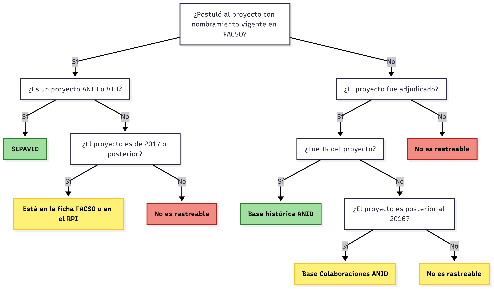

# 1. DATASOC

## Contexto

Para lograr posicionarse como un centro de generación de conocimiento basado en investigación social de relevancia nacional e internacional, la Facultad enfrentá los siguientes desafíos:

1) Falencias en las implementación de una gobernanza de datos efectiva

2) Carencia de canales claros que faciliten sistemáticamente la transferencia del conocimiento hacia la sociedad civil y los tomadores de decisiones

3) Poca preparación institucional para nuevos desafíso científicos y tecnológicos, tales como la inteligencia artificial, el machine learning, la big data y el procesamiento de lenguaje natural. 

## DATASOC

Se propone la creación de un Centro de Ciencia de Datos de la Facultad de Ciencias Sociales -- **DATASOC**.

DATASOC busca **posicionar a la Facultad de Ciencias Socilaes como un referentes nacional en el desarrollo de las ciencias de datos sociales**, articulando investigación, formación, gestión e impacto en un único Centro de Ciencia de Datos Sociales a través de las siguientes líneas de acción:

i) Investigación

ii) Formación

iii) Gobernanza de Datos

iv) Apoyo, Impacto y Transferencia

## Investigación

Objetivo: **Consolidar a FACSO como un nodo para el desarrollo de la investigación metodológica y metacientífica avanzada**

Posibles líneas de investigación:

a) Ciencias Sociales computacionales

b) Ciencia Abierta, metaciencia y bibliometría

c) Estudios sobre Instituciones de Educación Superior. 

## Formación 

Objetivo: **Establecer un espacio clave en la formación y capacitación de estudiantes, académicos y público general**

a) Coordinar académicos responsables de cursos metodológicos y de análisis de datos

b) Dar espacio para integrar estudiantes de pre y postgrado como pasantes, prácticantes o tesistas

c) Crear una oferta de cursos de extensión orientados al público externo

## Gobernanza de Datos

Objetivo: **Asumir un rol activo en la optimizacipon de la gestión y gobernanza de datos para las distintas unidades de la Facultad**

- Desarrollo de CINDAI en la Dirección de Investigación

- Ofrecer consultoría a otras unidades de la Facultad interesadas en fortalecer la gestión de sus datos internos o desarrollar plataformas de visualización. 

## Apoyo, Impacto y Transferencia

Objetivo: **Ofrecer servicios espacializados de acompañamiento técnico a lo largo del ciclo completo de investigación, promoviendo la contribución efectiva al debate público, el diseño de políticas públicas y la toma de decisiones basada en evidencia**

Las áreas de apoyo incluyen:

- Diseño de estudios
- Acceso y uso de datos secundarios
- Procesamiento y análisis reproducible de datos sociales
- Gestión, archivo y apertura de datos. 

# 2. Ciencia de Datos en Investigación (CINDAI)

## Principales fuentes de información

-   Actualmente, el principal repositorio de datos de proyectos de investigación es SEPA-VID: Ofrece actualización periódica a partir de plataformas de concursos internos y externos, así como descarga masiva desde bases científicas.

-   Otras fuentes incluyen los repositorios de ANID, además de instrumentos internos de la Facultad: RPI, SIDRA, Colaboratorio

-   Además, se trabaja con otras fuentes con distintos tipos de información. Principalmente, la base de datos de funcionarios académicos de la Facultad.

## Problemas identificados

-   La base de proyectos de SEPA-VID no incluye todos los proyectos vigentes y el ordenamiento está sujeto a cambios y errores.

-   La base de publicaciones no es eficiente para cubrir la diversidad de la producción científica de la Facultad.

-   Además, carece de libros de códigos y metadatos que faciliten su uso.

-   Capacidad limitada para trazar y analizar trayectorias de investigación del cuerpo académico

-   Carencia de una plataforma interna que articule los datos de investigación con otras dimensiones relevantes para la gestión académica -- Jerarquizaciones, género, internacionalización.

-   Falta de sistematización y escasa capacidad para generar reportes integrados y actualizados sobre productividad académica.

## Objetivo de la Propuesta

**Desarrollar un sistema local e integrado de gestión, producción y visualización de información científica en la Facultad de Ciencias Sociales. Este sistema integrará, consolidará y mantendrá actualizados los datos relacionados con las postulaciones a proyectos de investigación de los académicos/as de la Facultad, tranformándolos en información confiable y oportuna para la comunicación y la toma de decisiones**

## Objetivos Específicos

1.  Construir una base integrada de proyectos de investigación -- incluyendo proyectos adjudicados y no-adjudicados -- que permita reconstruir las trayectorias académicas de la Facultad en relación a su participación, postulación y adjudicación de proyectos de investigación. 

2.  Construir un sistema de visualización para gestión interna y difusión externa que ofrezca de manera eficiente y sintética reportes reproducibles sobre la investigación a nivel de la Facultad.

3.  Consolidar un entorno de gobernanza de datos, que incluya documentación técnica, metadatos estandarizados y flujos de trabajos claros, que garanticen que los datos almacenados sean encontrables, accesibles, interoperables y reutilizables.                                                            |

## Componente 1: Bases de Datos

1.  **Base integrada de datos de investigación**

La base contendrá de manera integrada información sobre el académico, sobre el proyecto y sobre la trayectoria académica de los miembros de la Facultad

2.  **Bases auxiliares**

Además, la base estará acompañada de otros conjuntos de datos que complementarán la información de la Base Integrada. Estas incluyen:

-   Base de datos de académicos retirados
-   Base de datos de colaboraciones institucionales
-   Base de datos de colaboración con académicos externos
-   Base de datos de palabras claves

## Alcance

-   Se incluirán en la Base Integrada:

    -   Datos de postulaciones y proyectos de adjudicados por académicos con nombramiento vigente en la Facultad, ya sea como Investigadores Responsables o como Coinvestigadores.

    -   Datos sobre proyectos adjudicados por académicos de la Facultad con anterioridad a su nombramiento en la Universidad.

    -   Datos sobre proyectos no ingresados a SEPA-VID, registrados en el RPI, la Ficha FACSO u otras fuentes de información.

## Factibilidad de inclusión de datos

## Componente 2: Visualización

1.  **Dashboards de uso interno**

Aplicaciones sencillas que permitan responder de manera rápida consultas del Equipo de la Dirección. [Maqueta](https://dip-facso.shinyapps.io/consultas/){target="_blank}

2.  **Dashboards de uso externo**

Plataforma de visualización pública con datos sintéticos sobre proyectos de investigación en la Facultad.

## Componente 3: Documentación

Se incluirá documentación clara sobre la construcción de las bases de datos y los visualizadores, incluyendo libros de códigos y reportes técnicos.

### Documentos disponibles

[Documento de trabajo](https://facso-investigacion.github.io/DAI-FACSO/)

-   Resumen del diagnóstico y la propuesta

[Manual de Uso](https://facso-investigacion.github.io/documentos-dai/index.html)

-   Descripción de la estructura de la base de datos integrada y propuesta de flujo para la actualización y el versionamiento de la base.

## Integración con otros sistemas de la Facultad

| Plataforma/Sistema   | Función                                                                                          | Nivel de la información | Público objetivo                                                                 |
|----------------------|--------------------------------------------------------------------------------------------------|-------------------------|----------------------------------------------------------------------------------|
| CINDI | Gestionar, producir y analizar datos sobre proyectos de investigación y trayectorias académicas  | Individual y agregado   | Interno (datos desagregados a nivel individual) Externo (datos agregados)    |
| Colaboratorio        | Difundir y reconocer las trayectorias de investigación de los académicos de la Facultad          | Individual              | Externo                                                                          |
| SIDRA                | Gestionar y reportar la distribución de responsabilidades académicas                             | Individual              | Interno    

## Costos

CINDAI no implica **costos adicionales**:

- CINDAI está pensando para ser manejado, mantenido y actualizado directamente por el equipo de gestión de la Dirección de Investigación, con sus capacidades humanas y técnicas actuales. No requerimos apoyo adicional de otras unidades ni que los académicos completen formularios adicionales. 

- CINDAI está construido principalmente en R -- un software libre y de código abierto -- por lo que no necesita compra de licencias. 

## Repositorios de la Dirección

-   Todos los repositorio de la Dirección se encuentran en una [organización de GitHub](https://github.com/facso-investigacion)

-   La gestión de información de la Dirección se concentra en 4 repositorios

+---------------------------------------------------------------------------------+--------------------------------------------------------------------------------------+----------------------+
| Nombre del repositorio                                                          | Descripción                                                                          | Acceso               |
+=================================================================================+======================================================================================+======================+
| [DAI-FACSO](https://github.com/facso-investigacion/DAI-FACSO)                   | En este repositorio se presenta públicamente la propuesta, su diagnóstico y objetivo | Público              |
+---------------------------------------------------------------------------------+--------------------------------------------------------------------------------------+----------------------+
| [bases-datos-dip](https://github.com/facso-investigacion/bases-datos-dip)       | Contiene base de datos originales y datos no anonimizados                            | Privado              |
+---------------------------------------------------------------------------------+--------------------------------------------------------------------------------------+----------------------+
| [datos-abiertos-dip](https://github.com/facso-investigacion/datos-abiertos-dip) | Contiene las bases de datos anonimizadas para uso público                            | Público              |
+---------------------------------------------------------------------------------+--------------------------------------------------------------------------------------+----------------------+
| [documentos-dai](https://github.com/facso-investigacion/documentos-dai)         | Incluye documentación esencial, como libros de códigos y manuales de uso             | Público              |
+---------------------------------------------------------------------------------+--------------------------------------------------------------------------------------+----------------------+
